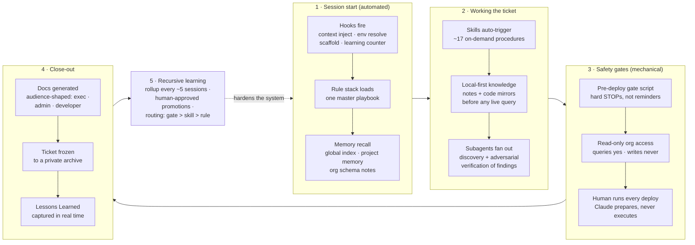

# CLAUDE.md — build the "How I Run Claude" visual-flow section

Instructions for generating a webpage section (placed at the **bottom of the page**) that
visualizes a personal Claude Code infrastructure as a flow diagram plus short supporting copy.

## Hard constraints

1. **No company, client, or vendor names.** No employer name, no client names, no managed-package
   namespaces, no ticket IDs, no repo/org names, no release-tool brand names. "Salesforce" is
   allowed as the platform; everything else stays generic ("client org", "proprietary managed
   package", "release pipeline", "ticket").
2. **No AI attribution in authored artifacts.** Author credit, where shown, is the site owner.
3. **Self-contained page section.** Inline CSS/JS only, no external libraries or fonts. Must be
   responsive (diagram scrolls horizontally inside its own container on small screens, page never
   scrolls sideways) and theme-aware (light/dark via `prefers-color-scheme`).
4. This is one section of an existing page — output a `<section>` fragment, not a full page.

## Section copy (use as-is or lightly edited)

**Headline:** How I Run Claude

**Intro paragraph:** My Claude setup isn't a chat window — it's an engineered system: a thin
always-on rule layer, a catalog of on-demand skills, deterministic hooks that fire at session
boundaries, layered memory stores, and mechanical safety gates in front of anything that touches
a live org. Every finished ticket feeds a learning loop that promotes lessons into gates, skills,
or rules — so the system gets stricter and smarter with each session.

**Caption under the diagram:** Lessons route by one question — can it be *enforced* instead of
*remembered*? Enforced rules never decay; prose rules dilute.

## The system model (content inventory for the diagram)

Five layers plus a feedback loop:

| Layer | What it is | Representative contents |
|---|---|---|
| Rules (always-on) | One master playbook, single source of truth, imported globally | Universal conduct rules; platform rules activate only when the session is detected as Salesforce work; prod is hands-off; the human runs every deploy; assumptions below ~85% confidence get flagged, load-bearing claims get adversarially verified |
| Skills (on-demand) | ~17 procedures that load only when a task matches their description | Lifecycle: intro/refinement → checkpoint → close-out/archive; authoring: code templates with mandatory recursion guards, deploy workflow; docs: four audience-shaped generators (formal docs, reviewer walkthroughs, zooming subsystem guides, HTML briefs/handoffs); meta: a skill that builds skills |
| Hooks (deterministic) | Scripts that fire at session boundaries — enforced, not remembered | Session-start: context injection, environment resolution, folder scaffolding, learning-loop counter; pre-tool-use: deploy blocker; pre-compaction: baseline preservation; session-end: transcript archive + backup |
| Memory (layered stores) | Local-first knowledge checked before any live query | Global cross-project memory index; per-project working memory; per-org schema notes (verified failures ranked most valuable); a patterns playbook fronted by an anti-patterns index |
| Safety gates (mechanical) | Hard STOPs in front of anything irreversible | Pre-deploy gate script (managed-metadata writes, naming violations, test-quality checks, attribution); read-only org access (queries yes, writes never); every deploy command is prepared by Claude but run by the human |
| Learning loop (the wrapper) | Real-time lesson capture → periodic rollup → approved promotion | Redirects logged the moment they happen; every ~5 sessions a hook forces a rollup proposing 1–3 promotions; human approval gates every promotion; routing litmus: gate > skill > rule |

## Visual flow — canonical diagram

Render this as the section's centerpiece. Preferred: hand-built HTML/CSS/SVG in the site's own
style. The Mermaid source below is the canonical structure to reproduce (node text, grouping,
edge directions); a Mermaid render is an acceptable fallback.

## Design guidance

- **Shape:** a left-to-right spine of the five numbered stages with the feedback edge returning
  from stage 5 to stage 1 — the loop IS the story; make that return arrow the most visually
  distinct element (dashed, accent color, labeled "hardens the system").
- **Stage styling:** each stage is a card containing its 3 sub-items; safety gates (stage 3) get
  a visually "harder" treatment (heavier border or warning accent) to read as a wall, not a step.
- **Responsive behavior:** the spine may wrap into a 2×3 grid or vertical stack under ~700px;
  keep the feedback arrow legible in both layouts (a curved return path or a repeated loop icon).
- **Tone:** engineering-diagram, not marketing infographic. Muted palette, one accent color,
  monospace or semi-mono labels acceptable.
- **No decorative emojis or glyph markers** — plain-text labels only.

## Sanitization checklist (verify before publishing)

- [ ] No employer/consultancy name anywhere (text, alt text, code comments, filenames)
- [ ] No client or org names
- [ ] No managed-package namespace prefixes (use `PKG__`-style placeholders if an example is needed)
- [ ] No ticket numbers or ticket-ID formats tied to a real tracker
- [ ] No repo names, GitHub handles, or internal file paths
- [ ] No third-party release-tool brand names ("release pipeline" instead)
- [ ] "Salesforce" as a platform term is the only proper noun permitted
